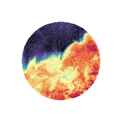
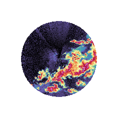
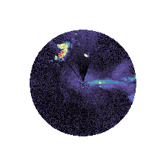
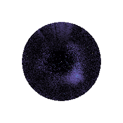

# Radar Image Labelling Codebook

A reference guide for annotators labelling radar imagery with LARS. Use this codebook to ensure consistent, reproducible labels across all annotators and sessions.

---

## 1. Overview

The purpose of this section is to label radar imagery for warm-season precipitation

- **Radar type:** ARM CSAPR2
- **Data source:** csapr2cfr.a1 datastream
- **Geographic scope:** Bankhead National Forest
- **Labelling task:** scene classification

---

## 2. Data Description

### 2.1 Input Fields

| Field | Units | Description |
|--------------------------|-------|-------------------------------------|
| *reflectivity* | dBZ | Intensity of returned radar signal |

### 2.2 Image Format

- **Spatial resolution:** 1 km by 1 km
- **Temporal resolution:** 10-minute intervals
- **Projection:** Polar coordinates projected onto a 256x256 image
- **Color scale:** ChaseSpectral colormap with vmin=-10 and vmax=60

---

## 3. Label Classes

Each image or region-of-interest must be assigned exactly one primary class. 

### 3.1 Primary Classes

| Label | Description |
|------------------------|-----------------------------------------------------------------------------|
| No Precipitation | No significant return; background noise only. The image will only have blue and black colors.|
| Stratiform Precipitation | The image must have no pink colors. Green, yellow and red colors are present in a widespread blob. |
| Isolated Convection | The image must have regions of dark red and pink colors. These dark red and pink regions must be separated by regions of black and blue, with no connection to other dark red and pink regions through yellow regions. Over half of the image must be blue or black. |
| Mesoscale Convective System | A string or connected cluster of dark red and pink colors must be present in the image. This string can take on a curved structure. There can be more than one such string or cluster in the image. The dark red and pink colors in the clusters must be connected by yellow regions. |
| Ambiguous / Uncertain | Cannot be classified with confidence. |

---

## 5. Labelling Procedure

1. Use :code:`lars.preprocessing.preprocess_radar_data` to generate images and a .csv file
2. The csv file will label all categories as UNKNOWN. This is just a placeholder for hand labelling.
3. According to the criteria above, label all images in the 'file_path' column of the .csv file.

---

## 6. Annotator Guidelines

- When in doubt, default to the class of the image preceeding it in time. 
- Use the provided example gallery (Section 8) to calibrate your judgement.
- Inter-annotator agreement should be checked periodically; raise disagreements with the team lead.
- If two or more categories are present in regions of the image, classify with the most widespread category in the image.

---

## 7. Quality Control

| Check | Method |
|-------|--------|
| Completeness | All images have a primary label |
| Consistency | Random sample reviewed by second annotator |
| Agreement metric | Cohen's κ computed per annotator pair |
| Outlier review | Labels deviating from model predictions flagged for review |

---

## 8. Example Gallery

*(Attach or link representative images for each primary class here.)*

| Class | Example Image | Notes |
|--------------------------|-----------------------------------|--------------------------|
| Stratiform Rain |  | Widespread yellows and reds |
| Mesoscale Convective System |  | Multiple lines of pinks and reds |
| Isolated Convection |  | Isolated reds not inter-connected |
| No Precipitation |  | No greens, yellows, reds or pinks |

---

## 9. Changelog

| Version | Date | Author | Changes |
|---------|------|--------|---------|
| 1.0 | 2025-04-23 | Robert Jackson | Initial release |

---

## 10. References

- Rinehart, R. E. (2004). *Radar for Meteorologists* (4th ed.).
- American Meteorological Society Glossary: https://glossary.ametsoc.org

