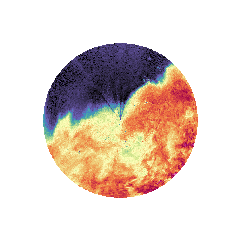
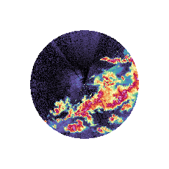
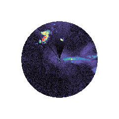
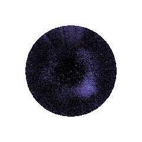

# Radar Image Labelling Codebook

A reference guide for annotators labelling radar imagery with LARS. Use this codebook to ensure consistent, reproducible labels across all annotators and sessions.

---

## 1. Overview

The purpose of this section is to label radar imagery for warm-season precipitation

- **Radar type:** ARM CSAPR2
- **Data source:** csapr2cfr.a1 datastream
- **Geographic scope:** Bankhead National Forest
- **Labelling task:** scene classification

---

## 2. Data Description

### 2.1 Input Fields

| Field | Units | Description |
|--------------------------|-------|-------------------------------------|
| *reflectivity* | dBZ | Intensity of returned radar signal |
| n_gates_50dBZ | percent | The percentage of gates greater than 50 dBZ |
| n_gates_30dBZ | percent | The percentage of gates greater than 30 dBZ |

### 2.2 Image Format

- **Spatial resolution:** 1 km by 1 km
- **Temporal resolution:** 10-minute intervals
- **Projection:** Polar coordinates projected onto a 2048x2048 image
- **Color scale:** NWSRef colormap with vmin=-20 and vmax=80

---

## 3. Label Classes

Each image or region-of-interest must be assigned exactly one primary class. 

### 3.1 Primary Classes

| Label | Description |
|------------------------|-----------------------------------------------------------------------------|
| No Precipitation | No significant return; background noise only. The image will be over 80 percent blue colors. The percentage of gates greater than 50 dBZ must not exceed 0.005 percent. If it does exceed 0.005 percent, then classify as Isolated Convection. |
| Stratiform Precipitation | The image must have no dark red or pink colors. Green, yellow, and light red colors are present in a widespread blob. The percentage of gates greater than 50 dBZ must not exceed 0.035 percent. If it does exceed 0.035 percent, then classify as a mesoscale convective system. |
| Isolated Convection | The image must have regions of yellow and dark red colors. These dark red regions must be separated by regions of blue, with no connection to other dark red and pink regions through yellow regions. Over half of the image must be blue or black. The percentage of gates with reflectivity greater than 30 dBZ must not exceed 1.3 percent. If it does exceed 1.3 percent, then classify as a mesoscale convective system. |
| Mesoscale Convective System | A string or connected cluster of dark red colors must be present in the image. This string can take on a curved structure. There can be more than one such string or cluster in the image. The dark red colors in the clusters must be connected by yellow or green regions. |
| Ambiguous | Cannot be classified with confidence. |

> **Note on enforcement.** Only the quantitative reflectivity thresholds in the
> descriptions above (e.g. "percentage of gates greater than X dBZ must not
> exceed Y percent") are validated automatically, and only when the
> corresponding `pct_gates_*` / `n_gates_*` columns are present in the data.
> Spatial and topological criteria — "separated by regions of…", "connected
> cluster", "curved structure", "widespread blob", "over half of the image" —
> are judged by the annotator or model and are **not** checked programmatically.

---

## 5. Labelling Procedure

1. Use :code:`lars.preprocessing.preprocess_radar_data` to generate images and a .csv file
2. The csv file will label all categories as UNKNOWN. This is just a placeholder for hand labelling.
3. According to the criteria above, label all images in the 'file_path' column of the .csv file.

---

## 6. Annotator Guidelines

The bullets in this section are passed verbatim to automated labelling models,
so they must be self-contained for a single image with no external context.

- If two or more categories are present in regions of the image, classify with the most widespread category in the image.

### 6.1 Human Annotators Only

These apply to human annotators and the review process. They are intentionally
kept out of the bullet list above because an automated model labels each image
independently, with no temporal context and no access to the example gallery.

- When in doubt, default to the class of the image preceding it in time.
- Use the provided example gallery (Section 8) to calibrate your judgement.
- Inter-annotator agreement should be checked periodically; raise disagreements with the team lead.

---

## 7. Quality Control

| Check | Method |
|-------|--------|
| Completeness | All images have a primary label |
| Consistency | Random sample reviewed by second annotator |
| Agreement metric | Cohen's κ computed per annotator pair |
| Outlier review | Labels deviating from model predictions flagged for review |

---

## 8. Example Gallery

*(Attach or link representative images for each primary class here.)*

| Class | Example Image | Notes |
|--------------------------|-----------------------------------|--------------------------|
| Stratiform Precipitation |  | Widespread yellows and reds |
| Mesoscale Convective System |  | Multiple lines of pinks and reds |
| Isolated Convection |  | Isolated reds not inter-connected |
| No Precipitation |  | No greens, yellows, reds or pinks |

---

## 9. Changelog

| Version | Date | Author | Changes |
|---------|------|--------|---------|
| 1.0 | 2025-04-23 | Robert Jackson | Initial release |
| 1.1 | 2026-07-13 | Robert Jackson | Calibrated reflectivity coverage thresholds against 1,212 hand-labelled CSAPR2 scenes: No Precipitation pct_gates_50dBZ 0.002→0.005 (clears observed No-Precip envelope); Stratiform pct_gates_50dBZ 0.02→0.035 (Youden-optimal vs MCS); Isolated Convection pct_gates_30dBZ 1.0→1.3 (Youden-optimal vs MCS). |

---

## 10. References

- Rinehart, R. E. (2004). *Radar for Meteorologists* (4th ed.).
- American Meteorological Society Glossary: https://glossary.ametsoc.org

